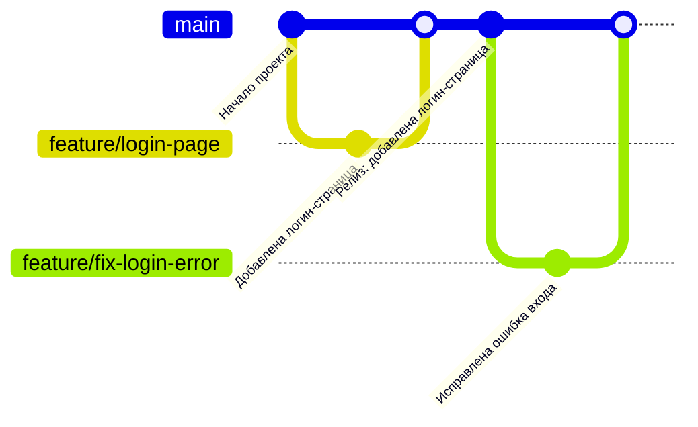

# Руководство

Добрый день ! Используется стратегию ветвления **Trunk-Based Development** и семантического версионирования. В этом документе описаны правила, которых нужно придерживаюсь при работе с данным репозиторием.

---

## Стратегия ветвления: Trunk-Based Development

### Основные правила:

1.  **Единая основная ветка:**
    - Ветка `main` содержит всегда рабочий и стабильный код, готовый к развертыванию.
    - Все изменения вносятся через короткоживущие ветки (`feature-ветки`)
2.  **Работа с feature-ветками:**
    - Создаются отдельные ветки для каждой задачи или фичи.
    - Формат название ветки:
      ```
      feature/{краткое-описание}
      ```
      Примеры:
      - `feature/login-page`
      - `feature/fix-registration-bug`
3.  **Работа с feature-ветками:**
    - Не держите feature-ветки слишком долго: желательно выполнять merge в `main` в течение 1–2 дней.
    - Интегрируйте изменения как можно чаще, чтобы избежать сложных конфликтов.
4.  **Pull Requests:**
    - Все изменения должны проходить через Pull Request (PR).



### Формат сообщения коммита:

Каждое сообщение коммита должно быть написано в следующем формате:

- **Типы коммитов:**
  - `feat` — добавление новой функциональности
  - `fix` — исправление ошибки
  - `docs` — изменения в документации
  - `refactor` — рефакторинг кода
  - `style` — изменения, не влияющие на логику (например, исправление стиля кода)
  - `test` — добавление или изменение тестов
  - `chore` — изменения, касающиеся задач, не связанных напрямую с кодом (например, обновление зависимостей)

### Детали оформления:

1. **Заголовок сообщения**:

   - Должен быть кратким (до 50 символов) и описывать суть изменений.

2. **Тело сообщения**:
   - Если изменения неочевидны, добавьте дополнительное описание в теле коммита.
   - Тело сообщения должно быть отделено пустой строкой от заголовка и не должно превышать 72 символов в строке.